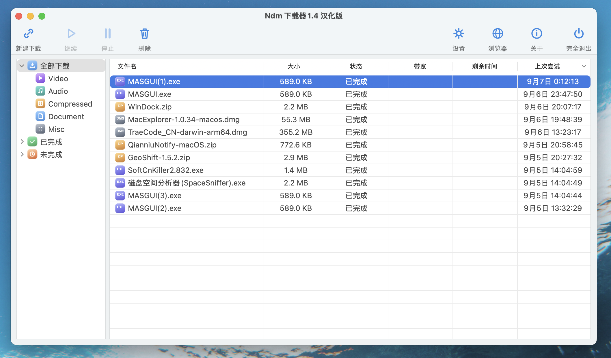
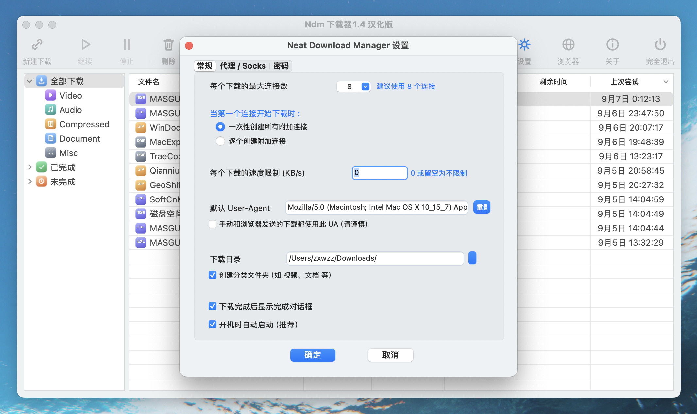
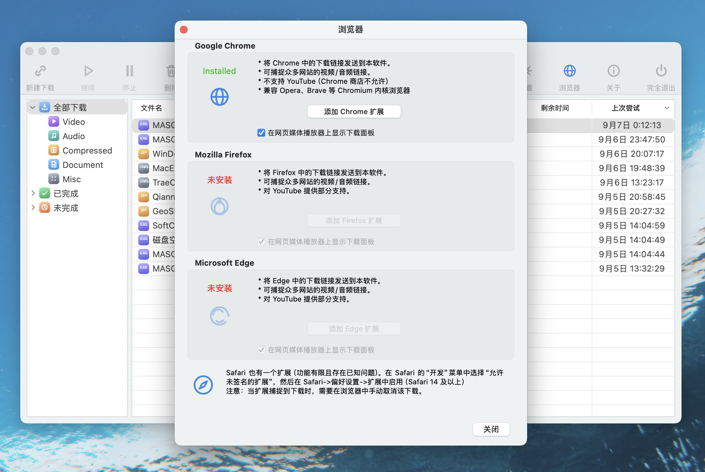
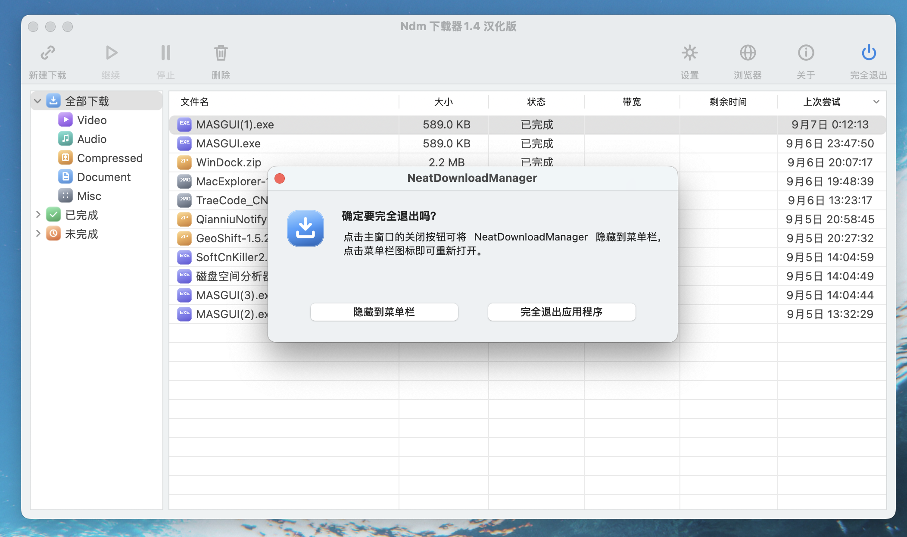
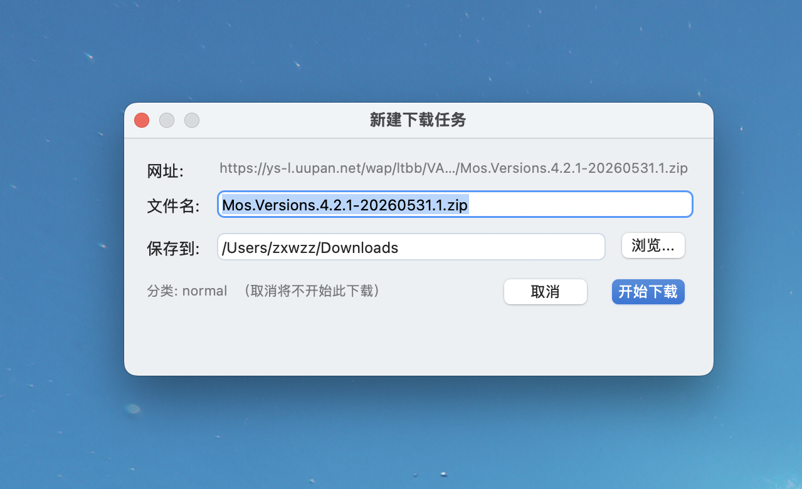
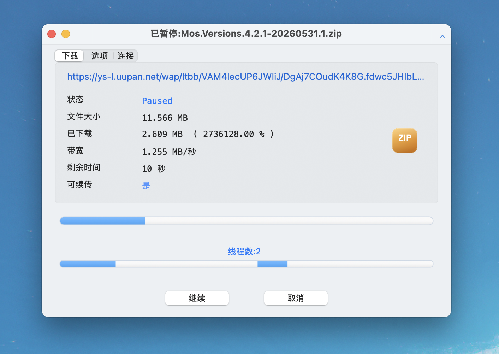

# ndm2-bluemod

macOS 版 NeatDownloadManager 2 美化工具集：蓝色主题改造 + 全格式自定义图标 + 二进制补丁脚本。

> **v2 更新 — 完美 Mac 原生 UI 风格**：重绘了全部图标（工具栏 / 侧边栏 / 状态栏 / 浏览器 / 30+ 扩展名徽章），并全面改造按钮、编辑框、进度条、复选框、列表选中行——统一圆角胶囊 + hover 微交互 + `#3D9BFF` 强调色，视觉与原生 macOS 应用无异。

> **免责声明**：本仓库不包含、也不分发 NeatDownloadManager 的任何二进制文件或原始资源。所有脚本仅供学习研究，请自行合法获取正软件，修改风险自负。

## 功能一览

| 模块 | 说明 |
|---|---|
| 主题注入 `ndm_theme.dylib` | v6 全面现代化：文字按钮（原生圆角胶囊 + hover/按压 + 主按钮蓝底白字）、进度条（胶囊 + 轨道底色 + 顶部高光）、列表选中行圆角 + 行 hover 淡蓝底、复选/单选自绘、输入框圆角化 + 聚焦蓝框。类局部 hook，不污染 NSView/NSControl 基类。每项独立回退开关 `defaults write com.NeatDownloadManager ndm_theme_disable_<x> -bool YES` |
| 蓝色进度条 | 主进度条 / 分段线程条 / 状态文字 全部从绿色改为 `#3D9BFF`（arm64+x64） |
| 全格式图标 | 30+ 扩展名统一圆角徽章图标，按类别配色（文档蓝/压缩包琥珀/视频紫/音频青/图片玫瑰/程序靛…） |
| 工具栏/侧边栏图标 | 轻量描线风格 SVG（新建/继续/暂停/删除/设置/浏览器/关于/退出 + 侧边栏分类） |
| 浏览器窗口图标 | Chrome/Firefox/Edge/Safari/Opera 统一蓝色描线风（`icons/browser/`） |
| 状态栏图标 | 精致版蓝色下载徽章（`neaticon.png`，保留 758 DPI 元数据） |
| 通用图标机制 | 原版 `getIconForExtension:` 本身就会查 `<ext>.png`：加新格式只需丢 PNG 进 Resources，零补丁（历史上的二进制 hook 是误判"死代码"的产物，已废弃，见 docs/NOTES.md 第 12 节） |
| 下载确认窗口 | IDM 风格：浏览器发起下载先弹确认窗（网址/文件名/浏览目录/开始取消），`ndm_confirm.dylib` swizzle 实现，见 `docs/CONFIRM_DIALOG.md` |
| 分析工具 | arm64 反汇编 / selref 交叉引用 / 方法表解析（MachO + capstone） |

## 截图

### 界面实拍（汉化版 · v2 完美 Mac 原生 UI 风格）








## 目录结构

```
scripts/    二进制补丁脚本（绿色进度条→蓝色、扩展名图标 hook）
tools/      MachO 分析辅助脚本（反汇编、选择器交叉引用）
icons/      全部图标源文件（SVG）与成品（PNG）、Swift 渲染器
docs/       踩坑笔记（DPI 元数据、codesign、字面量池、ObjC 方法表）
```

## 快速开始

> 目标版本：NDM 2 (v1.4 build 2023+)，universal 二进制。其他版本地址会变，需用 `tools/` 重新定位。

```bash
# 0. 备份
cp /Applications/NeatDownloadManager2.app/Contents/MacOS/NeatDownloadManager{,.bak}

# 1. 进度条改蓝（绿色 → #3D9BFF）
python3 scripts/patch_progress_color.py /Applications/NeatDownloadManager2.app

# 2. 注入通用扩展名图标 hook（arm64）
# 2.（已废弃）扩展名图标 hook 不再需要：原版方法自带 imageNamed(<ext>) 查找
#    直接把 icons/png/*.png 拷进 Resources 即可

# 3. 放入自定义图标：一键渲染 SVG→PNG 并部署（严格保留目标文件像素尺寸与 DPI）
bash icons/build_icons.sh /Applications/NeatDownloadManager2.app/Contents/Resources

# 4. 编译并注入主题 dylib（按钮/进度条/选中行/复选框/输入框现代化）
clang -arch arm64 -arch x86_64 -dynamiclib -fobjc-arc -framework AppKit \
  -o theme/ndm_theme.dylib theme/ndm_theme.m
python3 scripts/patch_inject_dylib.py /Applications/NeatDownloadManager2.app \
  @executable_path/../Frameworks/ndm_theme.dylib
cp theme/ndm_theme.dylib /Applications/NeatDownloadManager2.app/Contents/Frameworks/

# 5. 检查 PNG DPI（状态栏图标消失的头号原因，见 docs/NOTES.md）
bash scripts/check_dpi.sh /Applications/NeatDownloadManager2.app/Contents/Resources

# 6. 重签名（顺序很重要）
bash scripts/resign.sh /Applications/NeatDownloadManager2.app
```

以后想加新格式图标：只需把 `<扩展名>.png` 丢进 Resources，不用再碰二进制。

## 主要踩坑（详见 docs/NOTES.md）

- **PNG DPI**：NSImage 点尺寸 = 像素 × 72/DPI，替换 PNG 不保留原 DPI 会让状态栏图标"消失"
- **codesign**：含 .appex 时先签插件再 deep 签主 App；中断残留 `*.cstemp*` 会污染 seal
- **颜色修改**：颜色是 `colorWithCalibratedRed:...` 的字面量池（__const double），池可能被多处共享，改前必须全量扫引用
- **图标 hook**：只可 clobber 调用方保存寄存器以外的死寄存器，回退路径依赖的寄存器必须原样保留

## License

MIT（仅限本仓库原创脚本与图标；NeatDownloadManager 是其作者的专有软件）
