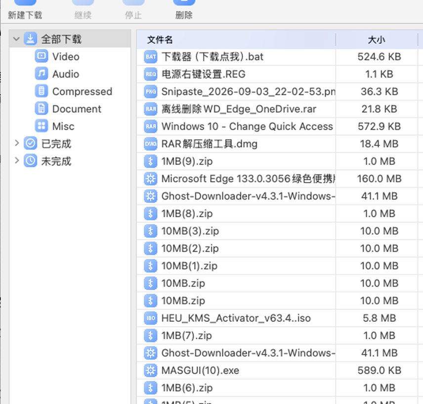
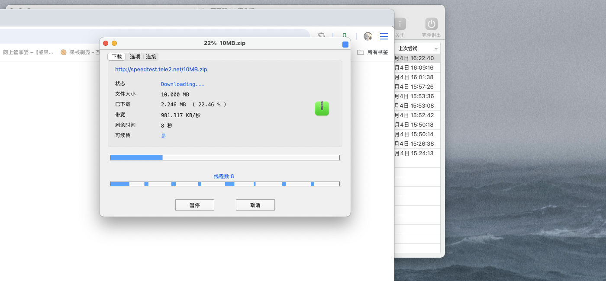
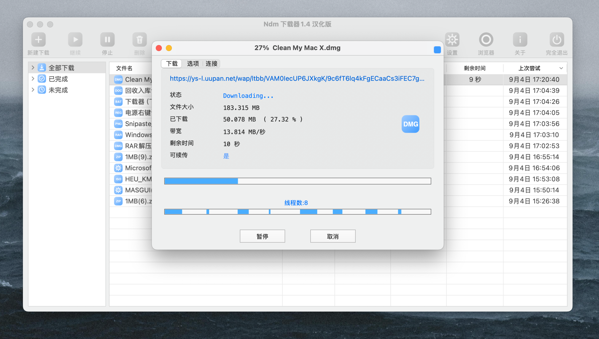
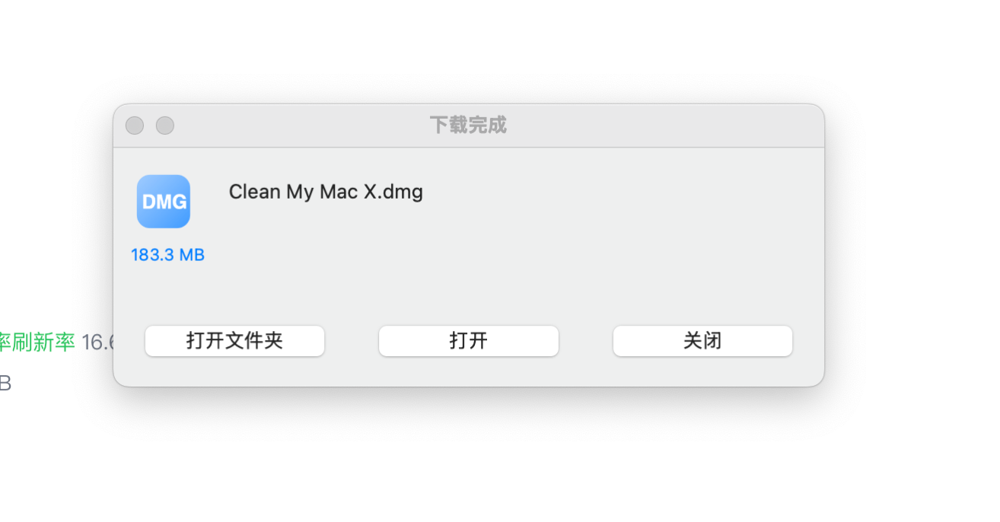

# ndm2-bluemod

macOS 版 NeatDownloadManager 2 美化工具集：蓝色主题改造 + 全格式自定义图标 + 二进制补丁脚本。

> **免责声明**：本仓库不包含、也不分发 NeatDownloadManager 的任何二进制文件或原始资源。所有脚本仅供学习研究，请自行合法获取正软件，修改风险自负。

## 功能一览

| 模块 | 说明 |
|---|---|
| 蓝色进度条 | 主进度条 / 分段线程条 / 状态文字 全部从绿色改为 `#3D9BFF`（arm64+x64） |
| 全格式图标 | 30+ 扩展名统一蓝色徽章图标（zip/pdf/exe/7z/rar/iso/dmg/doc/xls/mp3/mp4…） |
| 通用图标机制 | 二进制注入 hook：任意扩展名自动查找 `<ext>.png`，加新格式零补丁 |
| 工具栏/侧边栏图标 | 统一圆角方块徽章风格 SVG 源文件 |
| 分析工具 | arm64 反汇编 / selref 交叉引用 / 方法表解析（MachO + capstone） |

## 截图

### 改造效果





### 界面实拍（汉化版）





## 目录结构

```
scripts/    二进制补丁脚本（绿色进度条→蓝色、扩展名图标 hook）
tools/      MachO 分析辅助脚本（反汇编、选择器交叉引用）
icons/      全部图标源文件（SVG）与成品（PNG）、Swift 渲染器
docs/       踩坑笔记（DPI 元数据、codesign、字面量池、ObjC 方法表）
```

## 快速开始

> 目标版本：NDM 2 (v1.4 build 2023+)，universal 二进制。其他版本地址会变，需用 `tools/` 重新定位。

```bash
# 0. 备份
cp /Applications/NeatDownloadManager2.app/Contents/MacOS/NeatDownloadManager{,.bak}

# 1. 进度条改蓝（绿色 → #3D9BFF）
python3 scripts/patch_progress_color.py /Applications/NeatDownloadManager2.app

# 2. 注入通用扩展名图标 hook（arm64）
python3 scripts/patch_ext_icon_hook.py /Applications/NeatDownloadManager2.app

# 3. 放入自定义图标：把 icons/png/*.png 拷进 App Resources
cp icons/png/*.png /Applications/NeatDownloadManager2.app/Contents/Resources/

# 4. 检查 PNG DPI（状态栏图标消失的头号原因，见 docs/NOTES.md）
bash scripts/check_dpi.sh /Applications/NeatDownloadManager2.app/Contents/Resources

# 5. 重签名（顺序很重要）
bash scripts/resign.sh /Applications/NeatDownloadManager2.app
```

以后想加新格式图标：只需把 `<扩展名>.png` 丢进 Resources，不用再碰二进制。

## 主要踩坑（详见 docs/NOTES.md）

- **PNG DPI**：NSImage 点尺寸 = 像素 × 72/DPI，替换 PNG 不保留原 DPI 会让状态栏图标"消失"
- **codesign**：含 .appex 时先签插件再 deep 签主 App；中断残留 `*.cstemp*` 会污染 seal
- **颜色修改**：颜色是 `colorWithCalibratedRed:...` 的字面量池（__const double），池可能被多处共享，改前必须全量扫引用
- **图标 hook**：只可 clobber 调用方保存寄存器以外的死寄存器，回退路径依赖的寄存器必须原样保留

## License

MIT（仅限本仓库原创脚本与图标；NeatDownloadManager 是其作者的专有软件）
